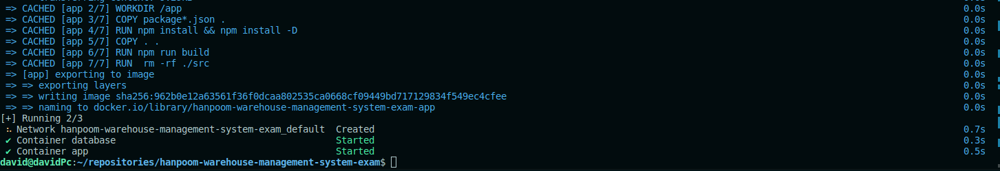

# Hanpoom Warehouse Management System Examination

This Repository are for Hanpoom Warehouse Management System examination. feel free to explore the codebase of this project.

Thanks :)

### List of needed dependencies to be installed in your machine for you to able to run this project properly.

- Node.js LTS 20 - Used in this project during development.
- Docker - For database, backend setup and containerization
- Docker Compose - For automation of local infra setup.

### Steps for running the project properly.

1. Make sure you have needed dependencies working correctly before you proceed and also follow 1 by 1 to prevent issues.

2. Create .env file inside the project root directory and add this value inside and save it.

```
NODE_ENV=development

MYSQLDB_USER=root
MYSQLDB_ROOT_PASSWORD=<your-database-password>
MYSQLDB_DATABASE=<your-database-name>
MYSQLDB_LOCAL_PORT=<your-local/external-mysql-port>
MYSQLDB_DOCKER_PORT=<your-docker/internal-mysql-port>

NODE_LOCAL_PORT=<your-local/external-backend-port>
NODE_DOCKER_PORT=<your-docker/internal-backend-port>
```

3. Execute this command in your terminal `docker compose up -d` to build and containerized the database and backend application. make sure that this is the result.



4. Restore database backup inside of `<project-root-directory>/database/init.sql` using your preferred way like using GUI or CLI and make sure you use the database settings resided in your `.env` file for you be able to connect either CLI or GUI

5. Test the api by using curl or postman by hitting this endpoint `http://localhost:<NODE_LOCAL_PORT>/api/v1/picking-slips`.

## That's It! I hope this project will enable me to pass the examination.
